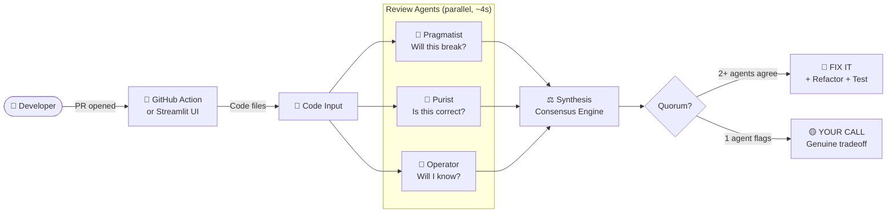

# CodeQuorum

**Three AI reviewers. Different philosophies. Confidence from consensus, signal from conflict.**

Add one YAML file to your repo. Every pull request gets reviewed by three specialist AI agents in parallel and results posted as a PR comment — automatically.

---

## Two Ways to Use CodeQuorum

| | GitHub Action | Streamlit UI |
|---|---|---|
| **What it does** | Auto-reviews every PR | Manual, interactive review |
| **Setup** | 2 steps | `pip install` + API key |
| **Best for** | Your team's daily workflow | Exploring a repo, one-off reviews |

---

## GitHub Action — Auto-Review Every PR

### What You Get

Every PR automatically gets a comment like this:

```
## ⚖️ CodeQuorum Review

Reviewed: `my-repo (3 changed files)` · Model: Claude Sonnet 4.6
Findings: 4 total · 🔴 2 Fix It · 🟡 2 Your Call

> Two bugs with clear fixes. Two tradeoffs worth a team decision.

### 🔴 Fix It — Quorum Reached (2+ agents agreed)

**Discount logic overwrites premium discount silently** — `high` 🚢 🎯

*Add an explicit precedence order: loyalty bonus should stack, not overwrite.*

**Refactored:**
```python
def get_user_discount(user, cart_total):
    discount = cart_total * 0.15 if cart_total > 100 else 0
    if user.is_premium:
        discount = max(discount, cart_total * 0.10)
    if user.loyalty_years > 5:
        discount += cart_total * 0.05
    return cart_total - discount
```

**Test:**
```python
def test_premium_and_high_value_discount():
    user = User(is_premium=True, loyalty_years=0)
    assert get_user_discount(user, 120) == 120 * 0.85  # 15% not 10%
```

### 🟡 Your Call — Genuine Tradeoff (1 agent flagged)

**No logging on discount applied** 🔧

*Add audit log if this feeds into billing — silent discounts are hard to debug.*
```

### Setup (2 Steps)

**Step 1** — Create `.github/workflows/codequorum.yml` in your repo:

```yaml
name: CodeQuorum Review

on:
  pull_request:
    types: [opened, synchronize, reopened]

jobs:
  review:
    runs-on: ubuntu-latest
    permissions:
      pull-requests: write

    steps:
      - uses: actions/checkout@v4
        with:
          fetch-depth: 0

      - uses: actions/setup-python@v5
        with:
          python-version: "3.11"

      - run: pip install anthropic langgraph python-dotenv requests

      - run: |
          curl -sO https://raw.githubusercontent.com/suboss87/CodeQuorum/main/cli.py
          curl -sO https://raw.githubusercontent.com/suboss87/CodeQuorum/main/agents.py
          curl -sO https://raw.githubusercontent.com/suboss87/CodeQuorum/main/graph.py

      - run: python cli.py --path . --format markdown > review.md
        env:
          ANTHROPIC_API_KEY: ${{ secrets.ANTHROPIC_API_KEY }}

      - uses: actions/github-script@v7
        with:
          script: |
            const body = require('fs').readFileSync('review.md', 'utf8');
            await github.rest.issues.createComment({
              issue_number: context.issue.number,
              owner: context.repo.owner,
              repo: context.repo.repo,
              body
            });
```

**Step 2** — Add your API key as a repo secret:

`Settings → Secrets and variables → Actions → New repository secret`

Name: `ANTHROPIC_API_KEY`

That's it. Open a PR and CodeQuorum reviews it automatically.

---

## Streamlit UI — Interactive Review

```bash
git clone https://github.com/suboss87/CodeQuorum
cd CodeQuorum
pip install -r requirements.txt
cp .env.example .env   # add ANTHROPIC_API_KEY
streamlit run app.py
```

Connect your GitHub account, pick a repo from the dropdown, click **Convene Quorum**.

For GitHub OAuth setup (private repos), see `.env.example`.

---

## How It Works

Three specialist agents review your code independently and in parallel. Each has a different philosophy.

| Agent | Philosophy | Question |
|---|---|---|
| 🚢 Pragmatist | Ship working software | Will this actually break in production? |
| 🎯 Purist | Correctness above all | Does this code do what it claims? |
| 🔧 Operator | Survive at 3am | When this fails, will I know? Can I fix it fast? |

A synthesis agent then applies one rule: **if two or more agents flag the same root cause, it is a real bug (FIX IT)**. If only one flags something, it is a genuine tradeoff that needs a human decision (YOUR CALL).

FIX IT findings include:
- What is wrong and why
- A concrete refactor — actual rewritten code, not a suggestion
- A specific test case that would catch this bug

YOUR CALL findings include:
- What one reviewer saw
- The tradeoff to consider

Confidence comes from inter-agent agreement, not from an LLM rating its own certainty.

---

## Architecture



---

## Tech Stack

- **LangGraph** — fan-out / fan-in agent orchestration
- **ThreadPoolExecutor** — true parallel API calls (4s vs 15s sequential)
- **Multi-model** — Claude Sonnet 4.6, GPT-4o, Gemini 2.0 Flash
- **GitHub OAuth** — one-click repo access (public and private)
- **Streamlit** — UI

---

## Tests

```bash
pytest tests/ -v
```

---

*Built by Subash Natarajan*
