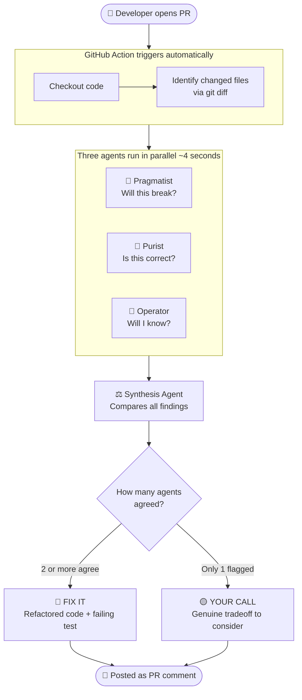

# CodeQuorum

**Three AI reviewers. Different philosophies. Confidence from consensus, signal from conflict.**

Add one YAML file to your repo. Every pull request gets reviewed by three specialist AI agents in parallel — results posted as a PR comment, automatically, with no manual step.

---

## Two Ways to Use

| | GitHub Action | Streamlit UI |
|---|---|---|
| **What it does** | Reviews every PR automatically | On-demand, interactive review |
| **Setup** | 2 steps — one YAML file + one secret | Clone + `pip install` + API key |
| **Best for** | Your team's daily workflow | Exploring a new repo, one-off audits |

---

## GitHub Action — Automatic PR Review

### What You Get

Every pull request receives a comment structured like this:

---

> ### ⚖️ CodeQuorum Review
>
> **Reviewed:** `my-repo (3 changed files)` · **Model:** Claude Sonnet 4.6
> **Findings:** 4 total · 🔴 2 Fix It · 🟡 2 Your Call
>
> *Two bugs with clear fixes. Two tradeoffs worth a team discussion.*
>
> ---
>
> ### 🔴 Fix It — Quorum Reached (2+ agents agreed)
>
> **Discount logic silently overwrites premium discount** — `high confidence` 🚢 🎯
>
> *Fix: use `max()` so the larger discount wins, then stack the loyalty bonus on top.*
>
> Includes refactored code and a failing test that catches this exact bug.
>
> ---
>
> ### 🟡 Your Call — Genuine Tradeoff (1 agent flagged)
>
> **No audit log when discount is applied** 🔧
>
> *Worth adding if this feeds into billing — silent discounts are hard to investigate.*

---

**Fix It** findings always include: what is wrong, a concrete refactor with rewritten code, and a test that would have caught the bug.

**Your Call** findings are real tradeoffs — flagged by one agent, not noise, but not a clear bug either. You decide.

### Setup

**Step 1 — Create this file in your repo:**

`.github/workflows/codequorum.yml`

```yaml
name: CodeQuorum Review

on:
  pull_request:
    types: [opened, synchronize, reopened]

jobs:
  review:
    runs-on: ubuntu-latest
    permissions:
      pull-requests: write

    steps:
      - uses: actions/checkout@v4
        with:
          fetch-depth: 0

      - uses: actions/setup-python@v5
        with:
          python-version: "3.11"

      - run: pip install anthropic langgraph python-dotenv requests

      - run: |
          curl -sO https://raw.githubusercontent.com/suboss87/CodeQuorum/main/cli.py
          curl -sO https://raw.githubusercontent.com/suboss87/CodeQuorum/main/agents.py
          curl -sO https://raw.githubusercontent.com/suboss87/CodeQuorum/main/graph.py

      - run: python cli.py --path . --format markdown > review.md
        env:
          ANTHROPIC_API_KEY: ${{ secrets.ANTHROPIC_API_KEY }}

      - uses: actions/github-script@v7
        with:
          script: |
            const body = require('fs').readFileSync('review.md', 'utf8');
            await github.rest.issues.createComment({
              issue_number: context.issue.number,
              owner: context.repo.owner,
              repo: context.repo.repo,
              body
            });
```

**Step 2 — Add your API key as a repo secret:**

Go to `Settings → Secrets and variables → Actions → New repository secret`

Set the name to `ANTHROPIC_API_KEY` and paste your [Anthropic API key](https://console.anthropic.com/).

Open a PR. CodeQuorum reviews it automatically and posts the comment.

---

## Streamlit UI — Interactive Review

```bash
git clone https://github.com/suboss87/CodeQuorum
cd CodeQuorum
pip install -r requirements.txt
cp .env.example .env   # add your ANTHROPIC_API_KEY
streamlit run app.py
```

Connect your GitHub account → pick a repo from the dropdown → click **Convene Quorum**.

For private repo access and GitHub OAuth setup, see `.env.example`.

---

## How It Works

### Three agents, three philosophies

CodeQuorum runs three specialist reviewers in parallel. Each asks a different question:

| Agent | Mindset | Question |
|---|---|---|
| 🚢 **Pragmatist** | Ship working software | Will this actually break in production? |
| 🎯 **Purist** | Correctness above all | Does this code do what it claims to do? |
| 🔧 **Operator** | Survive the 3am incident | When this fails, will anyone know? |

They review independently. Their disagreement is the signal.

### Confidence from consensus, not self-assessment

A synthesis agent receives all three sets of findings and applies one rule:

- **2 or more agents flag the same root cause** → it is a real bug. **Fix It.**
- **Only 1 agent flags something** → it is a genuine tradeoff. **Your Call.**

An LLM cannot reliably rate its own confidence. But when three agents with different priorities all arrive at the same conclusion — that convergence is meaningful.

### What gets reviewed on a PR

The GitHub Action uses `git diff` to identify exactly which files changed in the PR. Only those files are reviewed, not the entire codebase. This keeps reviews fast and focused.

---

## Architecture



---

## Tech Stack

| What | Why |
|---|---|
| **LangGraph** | Fan-out → fan-in agent orchestration with typed state |
| **ThreadPoolExecutor** | True parallel API calls — 4s instead of 15s sequential |
| **Multi-model support** | Claude Sonnet 4.6, GPT-4o, Gemini 2.0 Flash — your choice |
| **GitHub OAuth** | One-click repo connect — public and private repos |
| **Streamlit** | Interactive UI for on-demand review |

---

## Why This Pattern

Most AI code review tools simulate one reviewer. One reviewer has one set of biases. When that reviewer is an LLM, it produces fluent, confident output that reflects a single perspective.

Real engineering review is a panel. A pragmatist who wants to ship. A purist who cares about correctness. An operator who has been paged at 3am. They disagree. That disagreement tells you where the real tradeoffs are.

CodeQuorum is built around that idea — and the same pattern scales beyond code review to contract analysis, compliance checks, or any domain where a single AI reviewer is a single point of bias.

---

## Tests

```bash
pytest tests/ -v
```

---

*Built by Subash Natarajan*
