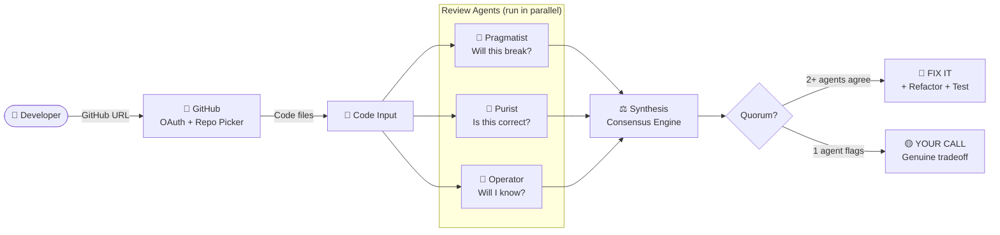

# CodeQuorum

**Three AI reviewers. Different philosophies. Confidence from consensus, signal from conflict.**

Challenge 2: The AI Pair Engineer | Careem WorkOS FDE Application

---

## The Problem

Most AI code review tools simulate one reviewer. One reviewer has one set of biases. When that reviewer is an LLM, it produces fluent, confident output that looks authoritative but reflects a single perspective.

Real engineering review is a panel. A pragmatist who wants to ship. A purist who cares about correctness. An operator who has been paged at 3am. They disagree. That disagreement tells you where the real tradeoffs live.

CodeQuorum is built around that idea.

---

## Architecture



---

## How It Works

Three specialist agents review your code independently. Each has a different philosophy and a different question it's trying to answer.

| Agent | Philosophy | Question |
|---|---|---|
| Pragmatist | Ship working software | Will this actually break in production? |
| Purist | Correctness above all | Does this code do what it claims? |
| Operator | Survive at 3am | When this fails, will I know? Can I fix it fast? |

A synthesis agent then receives all three sets of findings and applies one rule: if two or more agents flag the same root cause, it is a real bug. If only one agent flags something, it is a genuine tradeoff that needs a human decision.

**FIX IT findings include:**
- What is wrong and why
- A concrete refactor suggestion
- A specific test case that would catch this bug

**YOUR CALL findings include:**
- What one reviewer saw
- Why it might or might not matter
- The tradeoff to consider

Confidence comes from inter-agent agreement, not from an LLM rating its own certainty.

---

## Tech Stack

- **LangGraph** for fan-out/fan-in agent orchestration
- **ThreadPoolExecutor** for true parallel API calls (4 seconds vs 15 seconds sequential)
- **Multi-model** support: Claude Sonnet 4.6, GPT-4o, Gemini 2.0 Flash
- **GitHub OAuth** for one-click repo access (public and private)
- **Streamlit** for the UI

---

## Why This Pattern Matters

This is the orchestration pattern at the heart of enterprise WorkOS:

- Specialist agents with distinct value systems
- Parallel execution with structured handoff
- Disagreement as a first-class output, not noise to filter
- Confidence derived from consensus, not self-assessment

The same pattern applies at scale beyond code review: contract analysis, compliance checks, customer escalations. Any domain where a single AI reviewer is a single point of bias.

---

## Add to Your Repo — Auto-review Every PR

CodeQuorum can run automatically on every pull request and post results as a PR comment. No manual step needed.

**1. Add the workflow file to your repo**

Create `.github/workflows/codequorum.yml`:

```yaml
name: CodeQuorum Review
on:
  pull_request:
    types: [opened, synchronize]
jobs:
  review:
    runs-on: ubuntu-latest
    permissions:
      pull-requests: write
    steps:
      - uses: actions/checkout@v4
      - uses: actions/setup-python@v5
        with:
          python-version: "3.11"
      - run: pip install anthropic langgraph python-dotenv requests
      - run: |
          curl -sO https://raw.githubusercontent.com/suboss87/CodeQuorum/main/cli.py
          curl -sO https://raw.githubusercontent.com/suboss87/CodeQuorum/main/agents.py
          curl -sO https://raw.githubusercontent.com/suboss87/CodeQuorum/main/graph.py
      - run: python cli.py --path . --format markdown > review.md
        env:
          ANTHROPIC_API_KEY: ${{ secrets.ANTHROPIC_API_KEY }}
      - uses: actions/github-script@v7
        with:
          script: |
            const body = require('fs').readFileSync('review.md','utf8');
            await github.rest.issues.createComment({
              issue_number: context.issue.number,
              owner: context.repo.owner,
              repo: context.repo.repo, body });
```

**2. Add your API key as a repo secret**

`Settings → Secrets → New repository secret → ANTHROPIC_API_KEY`

That is it. Every PR now gets a CodeQuorum review posted automatically.

---

## Quick Start (Streamlit UI)

```bash
git clone https://github.com/suboss87/CodeQuorum
cd CodeQuorum
pip install -r requirements.txt
cp .env.example .env
# Add your API key to .env
streamlit run app.py
```

For GitHub OAuth setup (one-click repo connect), see `.env.example`.

## Tests

```bash
pytest tests/ -v
```

11 tests, all passing.

---

*Built by Subash Natarajan*
