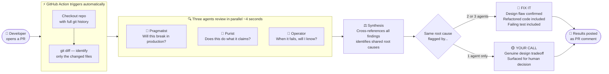

# CodeQuorum

**An AI that codes alongside developers — detecting design flaws, proposing tests, and refactoring.**

Add one YAML file to your repo. Every pull request is automatically reviewed and results posted as a PR comment — no UI, no manual step, no context switching.

---

## What It Does

Three specialist AI agents review every pull request in parallel. When at least two agents independently identify the same flaw, CodeQuorum does three things:

**1. Detects the design flaw** — names exactly what is wrong and why it breaks

**2. Proposes a test** — a concrete, failing test case that would have caught the bug

**3. Refactors the code** — the actual corrected implementation, not a suggestion

When only one agent flags something, it surfaces it as a genuine design tradeoff — a real consideration that needs a human decision, not noise to ignore.

---

## How It Works



### Three agents. Three philosophies.

Diversity of perspective comes from distinct agent philosophies — not from switching models.

| Agent | Mindset | Design flaw it catches |
|---|---|---|
| 🚢 **Pragmatist** | Ship working software | Logic that will produce wrong output in production |
| 🎯 **Purist** | Correctness is non-negotiable | Code that doesn't do what it claims to do |
| 🔧 **Operator** | Survive the 3am incident | Silent failures and invisible failure modes |

### Confidence from consensus, not self-assertion

An LLM cannot reliably rate its own confidence. But when two or three agents with fundamentally different priorities all flag the same root cause — that convergence is meaningful. CodeQuorum derives confidence from inter-agent agreement, not from asking the model to score itself.

---

## Example PR Comment

---

> ### ⚖️ CodeQuorum Review
>
> **Reviewed:** `payments-service (2 changed files)`
> **Design flaws:** 3 total · 🔴 2 Fix It · 🟡 1 Your Call
>
> *Two confirmed bugs with refactors and tests. One design tradeoff to consider.*
>
> ---
>
> ### 🔴 Fix It — Refactored Code + Test
>
> **Discount logic silently overwrites premium discount** — `2/3` 🚢 🎯
>
> *Use max() so the larger discount wins, then stack the loyalty bonus on top.*
>
> Refactored code and a failing test are included in the comment.
>
> ---
>
> ### 🟡 Your Call — Design Tradeoff
>
> **No audit log when a discount is applied** 🔧
>
> *Worth adding if this feeds into billing — silent discounts are hard to investigate.*

---

## Add to Your Repo

**Step 1 — Create this file:**

`.github/workflows/codequorum.yml`

```yaml
name: CodeQuorum Review

on:
  pull_request:
    types: [opened, synchronize, reopened]

jobs:
  review:
    runs-on: ubuntu-latest
    permissions:
      pull-requests: write

    steps:
      - uses: actions/checkout@v4
        with:
          fetch-depth: 0

      - uses: actions/setup-python@v5
        with:
          python-version: "3.11"

      - run: pip install anthropic langgraph python-dotenv requests

      - run: |
          curl -sO https://raw.githubusercontent.com/suboss87/CodeQuorum/main/cli.py
          curl -sO https://raw.githubusercontent.com/suboss87/CodeQuorum/main/agents.py
          curl -sO https://raw.githubusercontent.com/suboss87/CodeQuorum/main/graph.py

      - run: python cli.py --path . --format markdown > review.md
        env:
          ANTHROPIC_API_KEY: ${{ secrets.ANTHROPIC_API_KEY }}

      - uses: actions/github-script@v7
        with:
          script: |
            const body = require('fs').readFileSync('review.md', 'utf8');
            await github.rest.issues.createComment({
              issue_number: context.issue.number,
              owner: context.repo.owner,
              repo: context.repo.repo,
              body
            });
```

**Step 2 — Add your API key as a repo secret:**

`Settings → Secrets and variables → Actions → New repository secret`

Name: `ANTHROPIC_API_KEY`

Open a PR. CodeQuorum reviews it and posts the comment automatically.

---

## Interactive UI (optional)

The GitHub Action is the primary way to use CodeQuorum — fully automatic, no UI needed.

A Streamlit UI is also available for reviewing any repo on demand:

```bash
git clone https://github.com/suboss87/CodeQuorum
cd CodeQuorum
pip install -r requirements.txt
cp .env.example .env   # add ANTHROPIC_API_KEY
streamlit run app.py
```

Connect your GitHub account → pick a repo → click **Convene Quorum**.

---

## Tests

```bash
pytest tests/ -v
```

---

*Built by Subash Natarajan*
