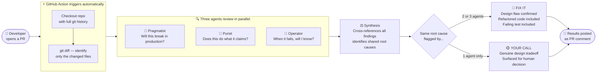

# CodeQuorum

**Pull request review by three Claude agents with different priorities. A problem is flagged as a fix only when two of them find it independently.**

[](https://github.com/suboss87/CodeQuorum/actions/workflows/tests.yml) [](LICENSE)

Built for *The AI Pair Engineer*, challenge #2.

Add one YAML file to your repo. Every pull request is automatically reviewed and results posted as a PR comment — no UI, no manual step, no context switching.

---

## What It Does

Three specialist AI agents review every pull request in parallel. When at least two agents independently identify the same flaw, CodeQuorum does three things:

**1. Detects the design flaw** — names exactly what is wrong and why it breaks

**2. Proposes a test** — a concrete, failing test case that would have caught the bug

**3. Refactors the code** — the actual corrected implementation, not a suggestion

When only one agent flags something, it surfaces it as a genuine design tradeoff — a real consideration that needs a human decision, not noise to ignore.

---

## How It Works


```mermaid
flowchart LR
    A([👤 Developer\nopens a PR]) --> B

    subgraph B ["⚡ GitHub Action triggers automatically"]
        direction TB
        B1["Checkout repo\nwith full git history"] --> B2["git diff — identify\nonly the changed files"]
    end

    B --> C

    subgraph C ["🔍 Three agents review in parallel"]
        direction TB
        P["🚢 Pragmatist\nWill this break in production?"]
        U["🎯 Purist\nDoes this do what it claims?"]
        O["🔧 Operator\nWhen it fails, will I know?"]
    end

    C --> D["⚖️ Synthesis\nCross-references all findings\nidentifies shared root causes"]

    D --> E{"Same root cause\nflagged by..."}

    E -->|"2 or 3 agents"| F["🔴 FIX IT\nDesign flaw confirmed\nRefactored code included\nFailing test included"]
    E -->|"1 agent only"| G["🟡 YOUR CALL\nGenuine design tradeoff\nSurfaced for human decision"]

    F --> H(["💬 Results posted\nas PR comment"])
    G --> H
```

### Three agents. Three philosophies.

Diversity of perspective comes from distinct agent philosophies — not from switching models.

| Agent | Mindset | Design flaw it catches |
|---|---|---|
| 🚢 **Pragmatist** | Ship working software | Logic that will produce wrong output in production |
| 🎯 **Purist** | Correctness is non-negotiable | Code that doesn't do what it claims to do |
| 🔧 **Operator** | Survive the 3am incident | Silent failures and invisible failure modes |

### Confidence from consensus, not self-assertion

An LLM cannot reliably rate its own confidence. But when two or three agents with fundamentally different priorities all flag the same root cause — that convergence is meaningful. CodeQuorum derives confidence from inter-agent agreement, not from asking the model to score itself.

---

## Example PR Comment

---

> ### ⚖️ CodeQuorum Review
>
> **Reviewed:** `payments-service (2 changed files)`
> **Design flaws:** 3 total · 🔴 2 Fix It · 🟡 1 Your Call
>
> *Two confirmed bugs with refactors and tests. One design tradeoff to consider.*
>
> ---
>
> ### 🔴 Fix It — Refactored Code + Test
>
> **Discount logic silently overwrites premium discount** — `2/3` 🚢 🎯
>
> *Use max() so the larger discount wins, then stack the loyalty bonus on top.*
>
> Refactored code and a failing test are included in the comment.
>
> ---
>
> ### 🟡 Your Call — Design Tradeoff
>
> **No audit log when a discount is applied** 🔧
>
> *Worth adding if this feeds into billing — silent discounts are hard to investigate.*

---

## Add to Your Repo

**Step 1 — Create this file:**

`.github/workflows/codequorum.yml`

```yaml
name: CodeQuorum Review

on:
  pull_request:
    types: [opened, synchronize, reopened]

jobs:
  review:
    runs-on: ubuntu-latest
    timeout-minutes: 10
    permissions:
      pull-requests: write

    steps:
      - uses: actions/checkout@v4
        with:
          fetch-depth: 0

      - uses: actions/setup-python@v5
        with:
          python-version: "3.11"
          cache: "pip"

      - run: pip install anthropic langgraph python-dotenv requests

      - run: |
          curl -sO https://raw.githubusercontent.com/suboss87/CodeQuorum/main/cli.py
          curl -sO https://raw.githubusercontent.com/suboss87/CodeQuorum/main/agents.py
          curl -sO https://raw.githubusercontent.com/suboss87/CodeQuorum/main/graph.py

      - id: review
        continue-on-error: true
        run: python cli.py --path . --format markdown > review.md
        env:
          ANTHROPIC_API_KEY: ${{ secrets.ANTHROPIC_API_KEY }}

      - if: steps.review.outcome == 'failure'
        run: |
          cat > review.md << 'EOF'
          ## ⚖️ CodeQuorum Review
          > Review could not complete. Check that `ANTHROPIC_API_KEY` is set under Settings → Secrets → Actions.
          EOF

      - uses: actions/github-script@v7
        with:
          script: |
            const fs = require('fs');
            const body = fs.readFileSync('review.md', 'utf8');
            const marker = '<!-- codequorum-review -->';
            const fullBody = marker + '\n' + body;

            const { data: comments } = await github.rest.issues.listComments({
              issue_number: context.issue.number,
              owner: context.repo.owner,
              repo: context.repo.repo,
            });

            const existing = comments.find(c => c.body.startsWith(marker));

            if (existing) {
              await github.rest.issues.updateComment({
                comment_id: existing.id,
                owner: context.repo.owner,
                repo: context.repo.repo,
                body: fullBody,
              });
            } else {
              await github.rest.issues.createComment({
                issue_number: context.issue.number,
                owner: context.repo.owner,
                repo: context.repo.repo,
                body: fullBody,
              });
            }
```

**Step 2 — Add your API key as a repo secret:**

`Settings → Secrets and variables → Actions → New repository secret`

Name: `ANTHROPIC_API_KEY`

Open a PR. CodeQuorum reviews it and posts the comment automatically.

---

## Interactive UI (optional)

The GitHub Action is the primary way to use CodeQuorum — fully automatic, no UI needed.

A Streamlit UI is also available for reviewing any repo on demand:

```bash
git clone https://github.com/suboss87/CodeQuorum
cd CodeQuorum
pip install -r requirements.txt
cp .env.example .env   # add ANTHROPIC_API_KEY
streamlit run app.py
```

Connect your GitHub account → pick a repo → click **Convene Quorum**.

---

## Limits

- **Up to 10 changed files per review, 30 KB each.** Larger pull requests are reviewed partially, and the comment says how many files were skipped.
- **Each agent reports at most 3 findings.** CodeQuorum aims for a few high-signal problems, not full coverage.
- **Findings can be wrong.** Agreement between agents raises confidence but does not prove a bug. Treat "Fix It" as a strong suggestion and run the proposed test.
- **Your code is sent to the Anthropic API** (`claude-sonnet-4-6`) using your own key. Don't enable it on repositories whose code you can't share with that provider.
- **The workflow above downloads the scripts from `main` on every run.** For production use, replace `main` in the three `curl` URLs with a commit SHA you have reviewed.

---

## Tests

```bash
pip install -r requirements.txt pytest
pytest tests/ -v   # 27 tests, no API key needed
```

---

*Built by Subash Natarajan*
